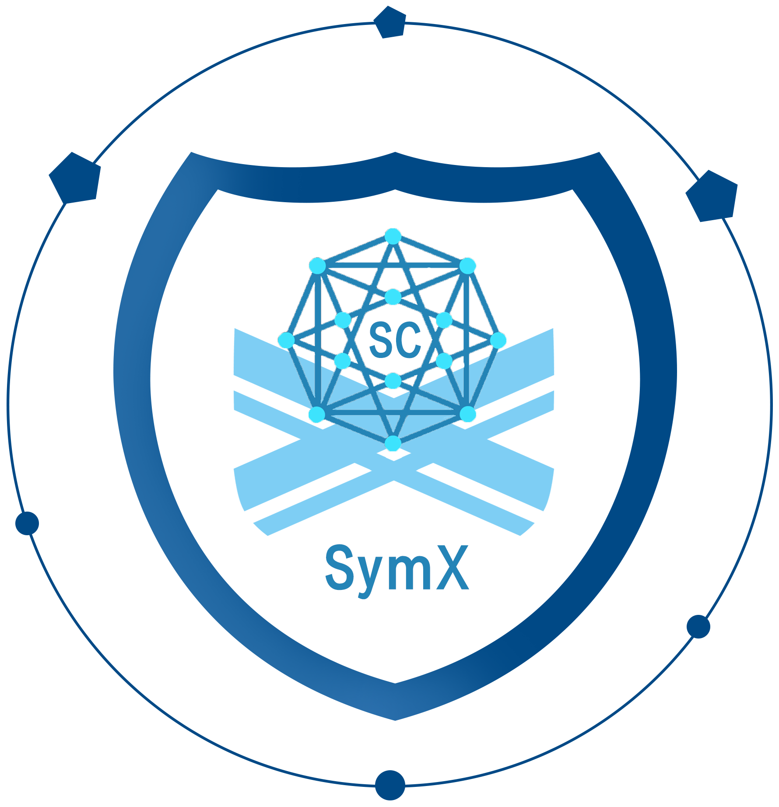
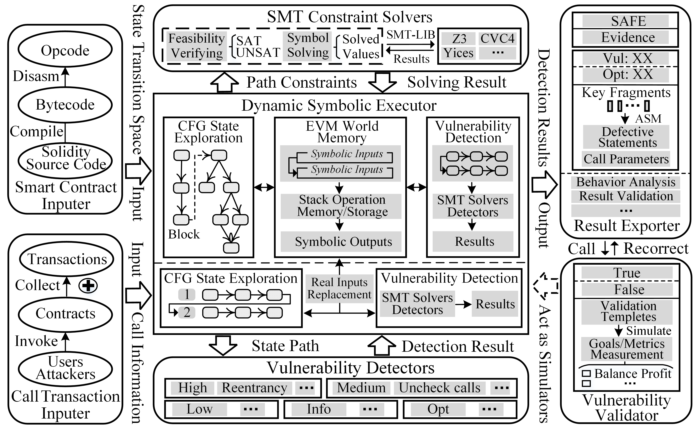

# SymX, a dynamic symbolic execution-based guardian for Ethereum smart contracts
The demo video is available at https://youtu.be/mM4U9vx7hsU.

This project is the supporting material of the paper titled "Demo: Enhancing Smart Contract Security Comprehensively through Dynamic Symbolic Execution", including: dataset, detection results, source code, etc.



SymX, the first symbolic execution-based security analysis art accounting for contract development and running stages. SymX is proposed to address three challenges: (i) Identify contract defective code snippets, while generating vulnerable call sequences to help developers fix them. (ii) Monitor abnormal call behaviors, especially for multiple continuous transactions. (iii) Validate numerous unexploitable detection results automatically because manual verification is labor-intensive. 



- [Bugs and Optimizationimizations Detection](#bugs-and-Optimizationimizations-detection)
- [How to Install](#how-to-install)
- [Publications](#publications)

## Bugs and Optimizationimizations Detection

### Detectors

The supported detectors are illustrated in the following table.

| Num  | Detector                  | What it Detects                                      | Impact | Confidence | Severity |
| ---- | ------------------------- | ---------------------------------------------------- | ------ | ---------- | -------- |
| 1    | `reentrancy-eth`          | Re-entry vulnerabilities (Ethereum theft)            | High   | probably   | High     |
| 2    | `suicidal`                | Check if anyone can break the contract               | High   | exactly    | High     |
| 3    | `controlled-delegatecall` | The delegate address out of control                  | High   | probably   | High     |
| 4    | `arbitrary-send`          | Check if Ether can be sent to any address            | High   | probably   | High     |
| 5    | `tod`                     | Transaction sequence dependence for receivers/ethers | High   | probably   | High     |
| 6    | `uninitialized-state`     | Check for uninitialized state variables              | High   | exactly    | High     |
| 7    | `uninitialized-storage`   | Check for uninitialized storage variables            | High   | exactly    | High     |
| 8    | `incorrect-equality`      | Check the strict equality of danger                  | Medium | exactly    | Medium   |
| 9    | `integer-overflow`        | Check for integer overflow/overflow                  | Medium | probably   | Medium   |
| 10   | `unchecked-lowlevel`      | Check for uncensored low-level calls                 | Medium | probably   | Medium   |
| 11   | `tx-origin`               | Check the dangerous use of tx.origin                 | Medium | probably   | Medium   |
| 12   | `unchecked-send`          | Check unreviewed send                                | Medium | probably   | Medium   |
| 13   | `timestamp`               | The dangerous use of block.timestamp                 | Low    | probably   | Low      |
| 14   | `block-other-parameters`  | Hazardous use variables (block.number etc.)          | Low    | probably   | Low      |
| 15   | `low-level-calls`         | Check low-level calls                                | Info   | exactly    | Info     |
| 16   | `msgvalue-equals-zero`    | The judgment of msg.value and zero.                  | Info   | exactly    | Info     |
| 17   | `send-transfer`           | Check Transfe to replace Send                        | Opt    | exactly    | Opt      |
| 18   | `boolean-equal`           | Check comparison with boolean constant               | Opt    | exactly    | Opt      |

## How to install

### Using Docker (Suggested)

```bash
docker pull scripthub/symx:v1
```

### Using Git

```bash
git clone https://github.com/Secbrain/SymX.git && cd Code/symx-master
```

Note that the solc-select will use the solc bin files in the /home/user/.solc-select (if user) or /root/.solc-select (if root user), so we need to unzip the solc files to that path by executing the following command.

```bash
tar -zcvf code/sourcecodes.part01.rar symx
unzip -d /home/user .solc-select.zip
cd /home/user/.solc-select/bin
rm solc-default
ln -s /root/.solc-select/usr/bin/solc-v0.4.0* solc-default
```

If you want to recreate the virtual environment, perform the following operations. Note that python3.8 needs to be replaced with the user's Python version.

```bash
virtualenv --python=/usr/bin/python3.8 venv
pip install torch==1.10.1
pip install tqdm
pip install scikit-learn==1.0.2
pip install pandas
pip install numpy==1.21.6
pip install pyevmasm==0.2.3
pip install evm_cfg_builder==0.3.1
pip install reportlab==3.6.12
pip install seaborn==0.12.2
pip install reportlab==3.6.12
pip install joblib==1.3.2
export PATH=$HOME/.solc-select:$PATH add to the bottom of venv/bin/activate
apt-get install graphviz (for the CFG figure generarion)
```

After that, the main install command is shown as follows.

```bash
pip install -e ".[native]"
```

Also, the solvers such as Z3, CVC4, and Yices need to be installed based on the following operations, which are the same as the Manticore.

#### Installing Z3

Using pip to install the solver Z3.

```bash
pip install z3-solver==4.12.1.0
```

#### Installing CVC4

For more details go to https://cvc4.github.io/. Otherwise, just get the binary and use it.

```bash
sudo wget -O /usr/bin/cvc4 https://github.com/CVC4/CVC4/releases/download/1.7/cvc4-1.7-x86_64-linux-opt
sudo chmod +x /usr/bin/cvc4
```

#### Installing Yices

Yices is incredibly fast. More details here https://yices.csl.sri.com/

```bash
sudo add-apt-repository ppa:sri-csl/formal-methods
sudo apt-get update
sudo apt-get install yices2
```

### The usage of SymX (in docker environment)

Update the current running dir. 

```bash
cd /symx/symx-master
```

Detect contract source code and output the detailed and simply reports.

```bash
/symx/symx-master/dist/method_testcase_num_contracts_sourcedetection_system/method_testcase_num_contracts_sourcedetection_system /symx/test/RealOldFuckMaker.sol 0.4.24 /data/RealOldFuckMaker1 all,main
```

Detect contract bytecode and output the detailed and simply reports.

```bash
/symx/symx-master/dist/method_testcase_num_contracts_binarydetection_system/method_testcase_num_contracts_binarydetection_system /symx/test/RealOldFuckMaker_bin.json /data/RealOldFuckMaker2 all,main
```

Detect contrac opcode and output the detailed and simply reports.

```bash
/symx/symx-master/dist/method_testcase_num_contracts_evmdetection_system/method_testcase_num_contracts_evmdetection_system /symx/test/RealOldFuckMaker_evm.json /data/RealOldFuckMaker3 all,main
```

Detect contrac source code.

```bash
/symx/symx-master/dist/method_testcase_num_contracts_sourcedetection/method_testcase_num_contracts_sourcedetection /symx/test/RealOldFuckMaker.sol 0.4.24 /data/RealOldFuckMaker1-1
```

Detect contrac bytecode.

```bash
/symx/symx-master/dist/method_testcase_num_contracts_binarydetection/method_testcase_num_contracts_binarydetection /symx/test/RealOldFuckMaker_bin.json /data/RealOldFuckMaker2-1
```

Detect contrac opcode.

```bash
/symx/symx-master/dist/method_testcase_num_contracts_evmdetection/method_testcase_num_contracts_evmdetection /symx/test/RealOldFuckMaker_evm.json /data/RealOldFuckMaker3-1
```

Identify contrac behavior with source code.

```bash
/symx/symx-master/dist/method_testcase_transaction_detection_source/method_testcase_transaction_detection_source /symx/test/RealOldFuckMaker.sol 0.4.24 /symx/test/user_0000000f.tx.json /data/RealOldFuckMaker1-2
```

Identify contrac behavior with bytecode.

```bash
/symx/symx-master/dist/method_testcase_transaction_detection_binary/method_testcase_transaction_detection_binary /symx/test/RealOldFuckMaker_bin.json /symx/test/user_0000000f.tx.json /data/RealOldFuckMaker2-2
```

Identify contrac behavior with opcode.

```bash
/symx/symx-master/dist/method_testcase_transaction_detection_evm/method_testcase_transaction_detection_evm /symx/test/RealOldFuckMaker_evm.json /symx/test/user_0000000f.tx.json /data/RealOldFuckMaker3-2
```

Identify contrac behavior with init transaction.

```bash
/symx/symx-master/dist/method_testcase_transaction_detection_tx/method_testcase_transaction_detection_tx /symx/test/user_0000000f_init.tx.json /symx/test/user_0000000f.tx.json /data/RealOldFuckMaker3-2
```

Validate detection result of *arbitrary-send* vulnerability.

```bash
/symx/symx-master/dist/arbitrary-send_transaction_verification/arbitrary-send_transaction_verification /symx/test/Arbitrarysend_validation.sol 0.4.24 /symx/test/Arbitrarysend_validation/user_00000005.tx.json /data/Arbitrarysend-1
```

Validate detection result of *reentrancy-eth* vulnerability.

```bash
/symx/symx-master/dist/reentrancy_transaction_verification/reentrancy_transaction_verification /symx/test/Reentrance_validation.sol 0.4.24 /symx/test/Reentrance_validation/user_00000001.tx.json /data/Reentrance-1
```

Validate detection result of *suicidal* vulnerability.

```bash
/symx/symx-master/dist/suicidal_transaction_verification/suicidal_transaction_verification /symx/test/Suicidal_validation.sol 0.4.24 /symx/test/Suicidal_validation/user_00000001.tx.json /data/Suicidal_validation-1
```

## License

SymX is licensed and distributed under the AGPLv3 license.

## Publications

### References
- [ReJection: A AST-Based Reentrancy Vulnerability Detection Method](https://www.researchgate.net/publication/339354823_ReJection_A_AST-Based_Reentrancy_Vulnerability_Detection_Method), Rui Ma, Zefeng Jian, Guangyuan Chen, Ke Ma, Yujia Chen - CTCIS 19
- [DefectChecker: Automated Smart Contract Defect Detection by Analyzing EVM Bytecode](https://ieeexplore.ieee.org/document/9337195), Jiachi Chen, Xin Xia, David Lo, John Grundy, Xiapu Luo, Ting Chena, Yujia Chen - IEEE TSE
- [Smart Contract Vulnerability Detection using Graph Neural Network](https://www.ijcai.org/proceedings/2020/454), Yuan Zhuang, Zhenguang Liu, Peng Qian, Qi Liu, Xiang Wang, Qinming He - IJCAI 20
- [Slither: A Static Analysis Framework For Smart Contracts](https://arxiv.org/abs/1908.09878), Josselin Feist, Gustavo Grieco, Alex Groce - WETSEB '19
- [ETHPLOIT: From Fuzzing to Efficient Exploit Generation against Smart Contracts](https://wcventure.github.io/FuzzingPaper/Paper/SANER20_ETHPLOIT.pdf), Qingzhao Zhang, Yizhuo Wang, Juanru Li, Siqi Ma - SANER 20
- [SmartCheck: Static Analysis of Ethereum Smart Contracts](https://orbilu.uni.lu/bitstream/10993/35862/3/smartcheck-paper.pdf), Sergei Tikhomirov, Ekaterina Voskresenskaya, Ivan Ivanitskiy, Ramil Takhaviev, Evgeny Marchenko, Yaroslav Alexandrov - WETSEB '18
- [Manticore: {A} User-Friendly Symbolic Execution Framework for Binariesand Smart Contracts](https://ieeexplore.ieee.org/document/8952204), Mark Mossberg, Felipe Manzano, Eric Hennenfent, Alex Groce, Gustavo Grieco, Josselin Feist, Trent Brunson, Artem Dinaburg - ASE '19
